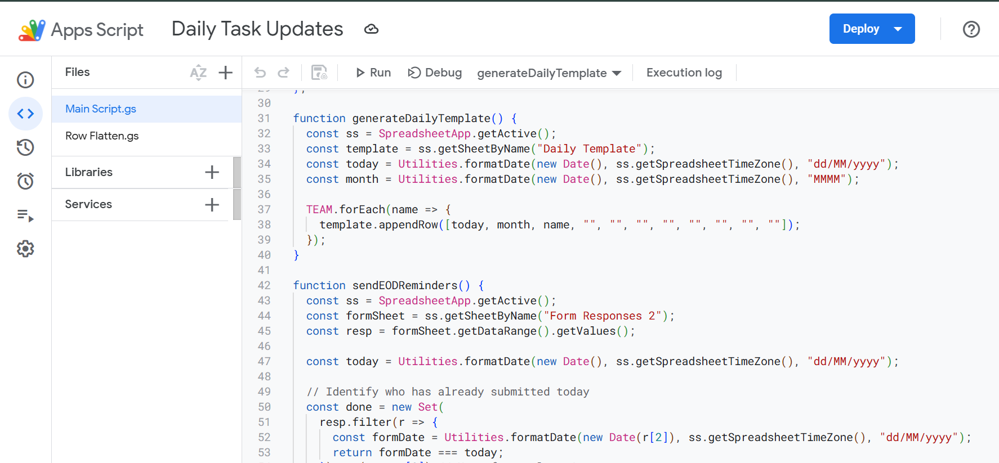

# EOD & Daily Task Tracking Automation — Internal Ops

**Role:** Project Manager / Automation Lead  
**Duration:** Jun 2025 — Jun 2025  
**Team:** 28 contributors (ops, content, PMs)  
**Tools:** Google Forms, Google Sheets, Google Apps Script, Email

## Context / Challenge
Daily progress updates were collected manually and inconsistently across the team. PMs spent significant time compiling status updates, which delayed visibility and left less time for removing blockers.

## Approach / Execution
- Built a Google Form for team EOD updates and linked responses to a central Google Sheet.  
- Developed Google Apps Script to automatically consolidate daily responses, generate a summary report, and email it to PMs/stakeholders.  
- Standardized fields in the form (status, blockers, next-day plan, hours) to improve data consistency and allow automated aggregation.  
- Created a manager dashboard in Google Sheets to surface daily trends and blockers.

## Results / Impact
- Eliminated manual status compilation and saved approximately **2,800 minutes/week → 46 hours 40 minutes/week** of collective time.  
- Reduced redundant EOD status meetings and converted remaining time into focused sessions for removing impediments.  
- Faster stakeholder visibility — PMs could act on blockers earlier, improving throughput.
- 

**Stakeholder feedback:**  
> “Saved end-of-the-day status update meetings and turned those into more productive sessions to address team concerns and remove impediments.”

## Future-fit / Transferable Insight
Small automation wins (Forms + Apps Script) create disproportionate capacity gains for teams. This pattern — standardize input, automate aggregation, surface actionable insights — is directly transferable to SaaS teams to speed decision-making and increase developer/productivity time.

## Lessons learned
- Standardization (one consistent form) is essential before automating aggregation.  
- Start small, measure time saved, then iterate (add more KPIs or channels).  
- A visible dashboard helps turn asynchronous updates into synchronous, high-value conversations.
